# Purpose

In modern enterprise applications, it is common to manage users and credentials across evolving systems, legacy databases, or federated identity stores. As password storage standards and compliance requirements advance, applications must support multiple hashing algorithms to ensure both backward compatibility and forward security.

This project demonstrates how to configure a Spring Security application to dynamically handle different password encoding strategies—such as BCrypt, PBKDF2, and SCrypt—based on user-specific preferences or stored metadata. This flexibility enables:

Seamless migration from legacy systems with older encoding schemes.

Support for NIST/FIPS-compliant algorithms (e.g., PBKDF2 with HMAC-SHA256).

Gradual upgrades without forcing a mass password reset.

Stronger security posture for high-privilege users using more robust algorithms.

By decoupling the password verification logic from a fixed encoder and instead determining the encoder at runtime, the system remains adaptable, secure, and compliant across diverse deployment environments.

# Seeing a Demo First

``` 
- 1. clone the repository : https://github.com/binitdatta/spring-boot-3-spring-security-different-pw-algorithm-poc
- 2. Open it in Your Favorite (or Favourite) IDE
- 3. Open a New Terminal and run mvn clean install
- 4. When the build completes, run : java -jar target/spring-boot-3-spring-security-different-pw-algorithm-poc-0.0.1-SNAPSHOT.jar
- 5. Open a new Browser 
```

## Now See the Screens in Order

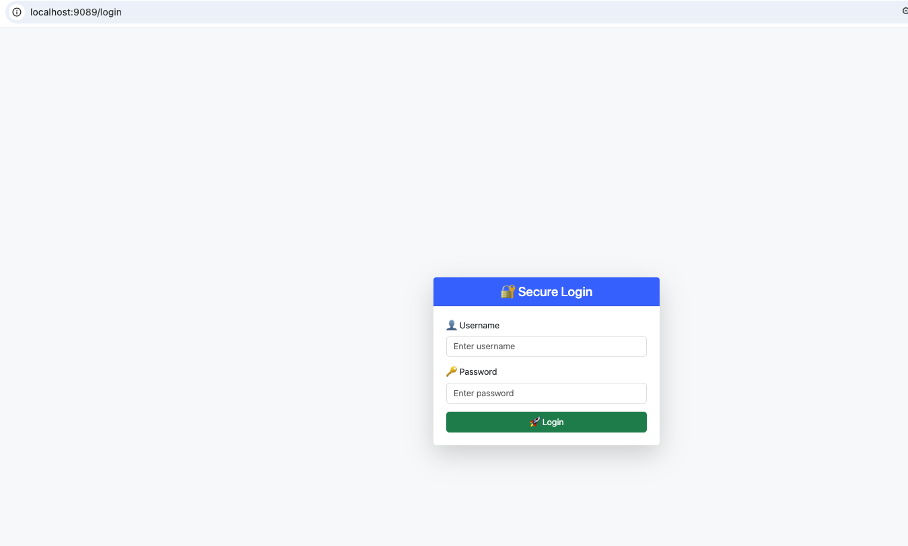

---

### Enter username and password

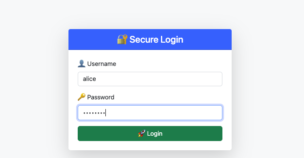

---

### The Home Screen

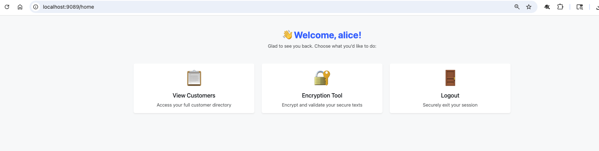

---

### Customer View

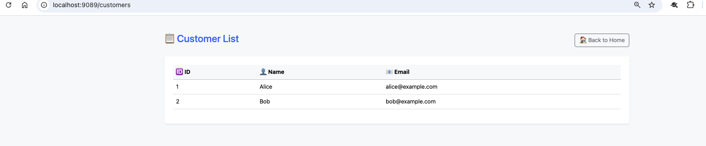

---

### How to Encrypt a Plain Text using BCrypt

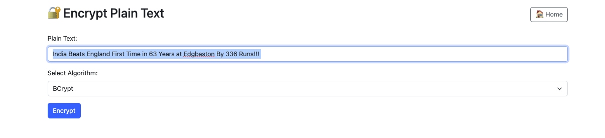

---

### Encrypted Cipher Text using BCrypt

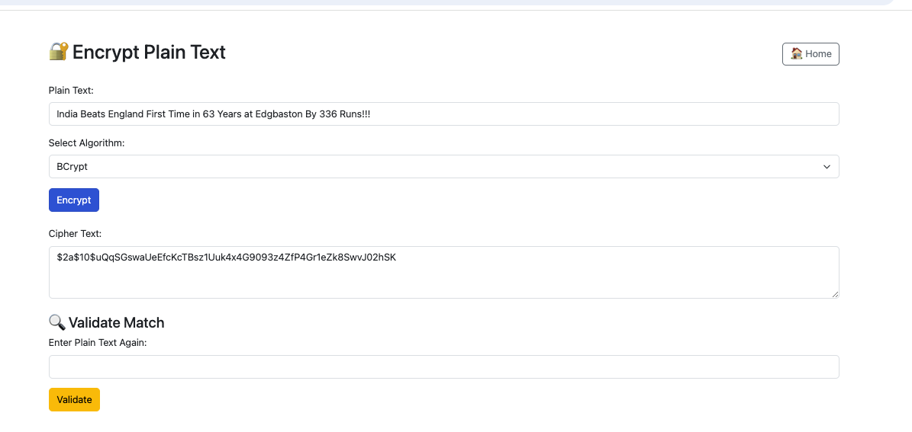

---

### Validating Plain Text using BCrypt

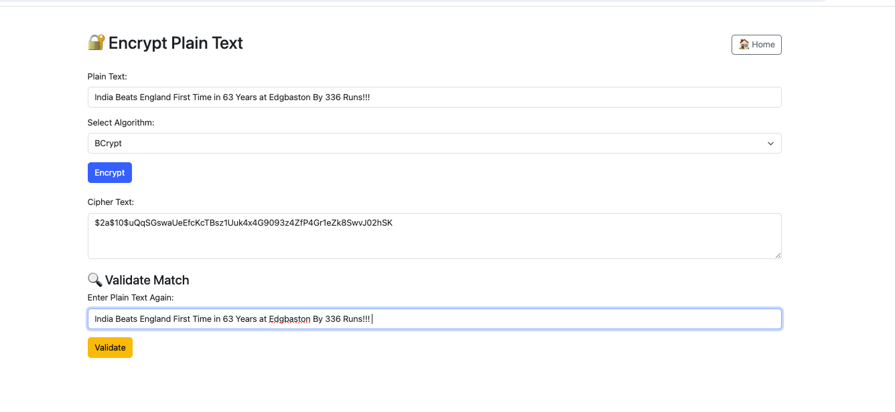

---

### Validating Plain Text using BCrypt Success

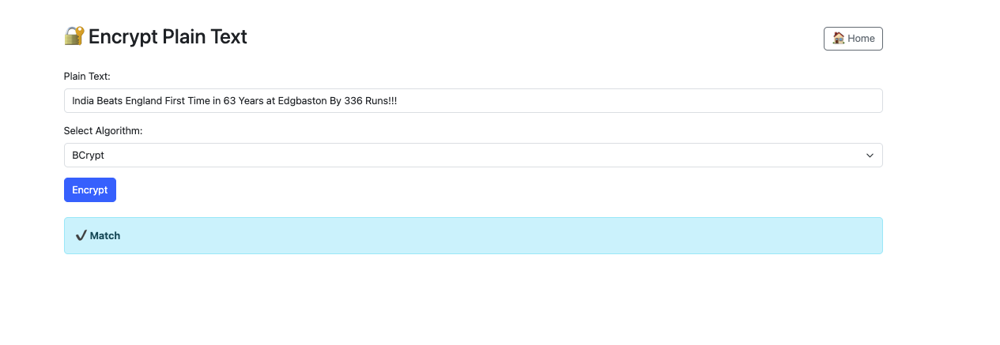

---

### Encrypting Plain Text using PBKDF2

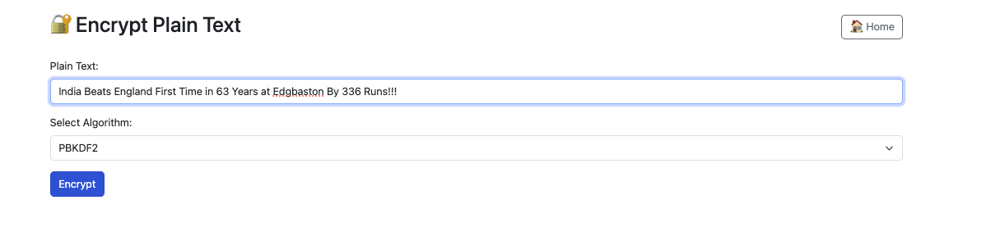

---

### Cipher Text using PBKDF2
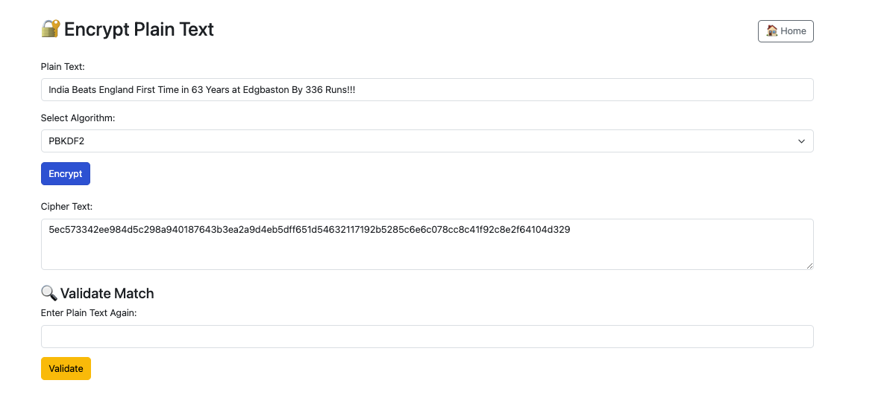

---

### Validating Plain Text using BCrypt Success

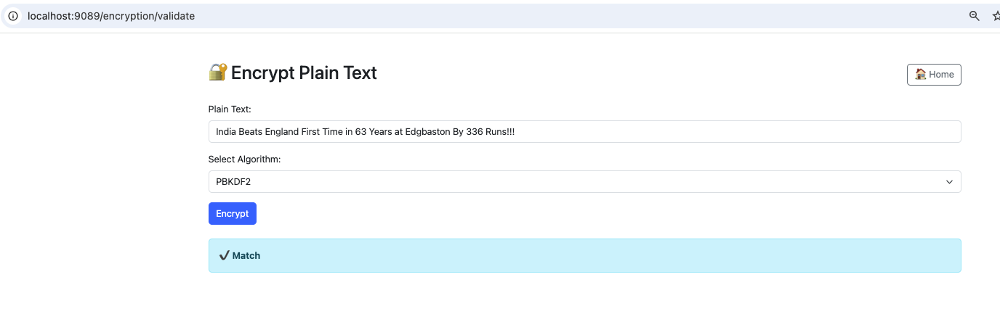

# Let's Turn to the Technical Aspects

# Handling Different Password Encodes in a Single App

Let's go step by step and **clearly explain** each of the involved classes, constructor arguments, and Spring Security password algorithm mechanics.

---

### ✅ 1. `getEncoder(PasswordAlgorithm algo)` Explanation

```
public PasswordEncoder getEncoder(PasswordAlgorithm algo) {
    return switch (algo) {
        case BCRYPT -> new BCryptPasswordEncoder();
        case SCRYPT -> new SCryptPasswordEncoder(16384, 8, 1, 32, 16);
        case PBKDF2 -> new Pbkdf2PasswordEncoder(
                GLOBAL_SECRET,
                16, // saltLength in bytes
                310000, // iterations
                Pbkdf2PasswordEncoder.SecretKeyFactoryAlgorithm.PBKDF2WithHmacSHA256
        );
    };
}
```

This method returns a **`PasswordEncoder`** implementation based on the selected algorithm.

---

#### 🔸 `BCryptPasswordEncoder()`

* Uses BCrypt hash function (internally includes salt).
* Default strength = 10 rounds (log2 cost).
* Example hash:

  ```
  $2a$10$EixZaYVK1fsbw1ZfbX3OXePaWxn96p36oA80aYSkqQOtA1y8t/JZm
  ```

---

#### 🔸 `SCryptPasswordEncoder(N, r, p, keyLen, saltLen)`

Constructor:

* `N` = CPU cost (16384)
* `r` = memory cost (8)
* `p` = parallelization (1)
* `keyLen` = derived key length (32 bytes)
* `saltLen` = salt length (16 bytes)

Used when memory-hardness is needed (e.g., better protection against ASICs/GPU cracking).

---

#### 🔸 `Pbkdf2PasswordEncoder(secret, saltLength, iterations, algorithm)`

Constructor:

* `secret` – Optional app-wide static key ("pepper")
* `saltLength` – Salt length in bytes (16 is typical)
* `iterations` – Stretching factor (higher = more secure, slower)
* `algorithm` – `PBKDF2WithHmacSHA256` (secure and FIPS-compliant)

Used for strong, standard-based password storage (often NIST recommended).

---

### ✅ 2. What Happens in `DataInitializer`

```
@Component
public class DataInitializer implements CommandLineRunner {
    ...
    public void run(String... args) {
        addUser("alice", "password", PasswordAlgorithm.BCRYPT, "USER");
        addUser("bob", "password", PasswordAlgorithm.SCRYPT, "USER");
        addUser("carol", "password", PasswordAlgorithm.PBKDF2, "ADMIN");
    }
}
```

This class is executed automatically at **application startup**, because:

* It implements `CommandLineRunner`, a Spring Boot interface whose `run()` method is called **after the app context loads**.
* It's annotated with `@Component`, so Spring auto-detects it.

**Purpose**: It seeds the database with test users using three different password algorithms.

The passwords are hashed using the appropriate encoder, stored in DB along with the chosen algorithm.

---

### ✅ 3. How Spring Security Detects the Encoder (`{id}...` format)

Spring Security supports **"Delegating Password Encoding"** through the `DelegatingPasswordEncoder`.

When you use `PasswordEncoderFactories.createDelegatingPasswordEncoder()` it prefixes hashes like this:

* `{bcrypt}$2a$10$...`
* `{pbkdf2}ddwDW...`
* `{scrypt}EXAMPLE...`

This tells Spring **which encoder to use at verification time**.

---

#### 🔍 Why Your Setup Doesn’t Use `{id}` Prefix:

Because you're **manually calling** `encoderFactory.getEncoder()` and directly using the resulting encoder. So Spring Security doesn't manage encoding strategy or embed `{id}` in the hash.

If you want `{id}` prefixes, you can wrap your `getEncoder(...)` logic like this:

```
PasswordEncoder delegating = PasswordEncoderFactories.createDelegatingPasswordEncoder();
```

And customize its mapping if needed:

```
Map<String, PasswordEncoder> encoders = new HashMap<>();
encoders.put("bcrypt", new BCryptPasswordEncoder());
encoders.put("scrypt", new SCryptPasswordEncoder(...));
encoders.put("pbkdf2", new Pbkdf2PasswordEncoder(...));
return new DelegatingPasswordEncoder("bcrypt", encoders); // "bcrypt" = default
```

---

### ✅ Summary

| Aspect              | Explanation                                                                        |
| ------------------- | ---------------------------------------------------------------------------------- |
| `getEncoder()`      | Returns encoder for the selected `PasswordAlgorithm`                               |
| `DataInitializer`   | Seeds DB with encoded users using different algorithms                             |
| Password Storage    | Does **not** prefix `{id}` unless `DelegatingPasswordEncoder` is used              |
| Spring Boot Startup | `CommandLineRunner.run()` is called after context is ready                         |
| Hash Prefix         | `{bcrypt}`, `{scrypt}` etc. help identify encoding algorithm when validating login |

---

# SCRYPT Overview

Great question. These parameters are **specific to the SCrypt key derivation function**, and they control **how strong** (and how resource-intensive) the password hashing process is. Let's explain each one clearly:

---

### 🔐 SCrypt Overview

SCrypt is a **memory-hard**, CPU-intensive password hashing algorithm designed to **resist hardware brute-force attacks** like those from GPUs, ASICs, and FPGAs.

It takes parameters that let you tune the **balance between security and performance**.

---

### ✅ Explanation of Parameters

#### 🔸 `N = 16384` — **CPU Cost (Iteration Count)**

* `N` controls the number of iterations and **directly affects CPU time**.
* It must be a power of 2 (e.g., 2⁴ = 16, 2¹⁴ = 16384).
* Higher `N` = **slower hashing**, more secure.
* **Default N in Spring Security = 2¹⁴ = 16384**

> 🧠 Think of it as: how much CPU work to do.

---

#### 🔸 `r = 8` — **Block Size (Memory Cost)**

* `r` affects the **amount of memory used**.
* Total memory used ≈ `128 * r * N` bytes
* With `r = 8`, `N = 16384` → ≈ 16 MB RAM used per hash
* Higher `r` = more RAM = harder for attackers with GPU clusters

> 🧠 Think of it as: how memory-hungry the operation is.

---

#### 🔸 `p = 1` — **Parallelization Parameter**

* `p` controls **how many parallel streams** to use.
* Doesn’t affect memory per stream, but impacts **total computation time**
* `p > 1` = better for multithreaded systems, but increases total resource cost

> 🧠 Think of it as: how many workers/processes to use simultaneously.

---

#### 🔸 `keyLen = 32` — **Derived Key Length in Bytes**

* The **output hash length**, typically 32 bytes = 256 bits
* This is the actual secret key generated by SCrypt and stored (often base64 or hex encoded)

> 🧠 Think of it as: how long the final password hash should be.

---

#### 🔸 `saltLen = 16` — **Salt Length in Bytes**

* Salt is a **random value added** to the password before hashing.
* Prevents precomputed attacks (e.g., rainbow tables).
* 16 bytes (128 bits) is a secure default.

> 🧠 Think of it as: random spice to make each password hash unique.

---

### ✅ Summary Table

| Parameter | Meaning            | Your Value | Purpose                                  |
| --------- | ------------------ | ---------- | ---------------------------------------- |
| `N`       | CPU cost           | `16384`    | Slows down brute-force attempts          |
| `r`       | Memory cost        | `8`        | Forces attacker to use more RAM          |
| `p`       | Parallelization    | `1`        | Controls multithreaded cost              |
| `keyLen`  | Output hash length | `32 bytes` | Final encoded password hash size         |
| `saltLen` | Random salt length | `16 bytes` | Prevents hash collisions, rainbow tables |

---

### 🔐 SCrypt PasswordEncoder Constructor Recap

```
SCryptPasswordEncoder encoder = new SCryptPasswordEncoder(
    16384, // N - CPU cost
    8,     // r - Memory cost
    1,     // p - Parallelization
    32,    // key length (bytes)
    16     // salt length (bytes)
);
```

This configuration is a good **balance between security and performance** for web applications.

---

# Does this Parallelization Parameter affect a single user's password hashing?

Great follow-up. Let's clarify:

### ❓ Does `p` (parallelization parameter) affect a **single user's password hashing**?

> ✅ **Yes, but only internally within the SCrypt algorithm** — and **not in the way you'd expect with multithreaded code**.

---

### 🔍 What `p` *Really* Does

* The **parallelization parameter `p`** controls how many **independent computational threads of memory-hard functions** SCrypt performs **internally**.
* Even though it's called *parallelization*, it **does not** mean SCrypt will spawn actual parallel OS threads (e.g., Java threads).
* Instead, it **designs the computation as if `p` independent computations are happening** and then combines them. It's **simulated parallelism** inside the algorithm.

---

### 🧠 In Plain English:

| Scenario                     | Effect of `p = 1`                                      | Effect of `p > 1`                                                |
| ---------------------------- | ------------------------------------------------------ | ---------------------------------------------------------------- |
| One user hashing a password  | SCrypt performs one sequential memory-hard computation | Performs `p` simulated computations — **more CPU + more memory** |
| Multi-user concurrent logins | Handled by app/thread pool, **not `p`**                | Same — `p` does **not parallelize across users**                 |
| Security effect              | Baseline protection                                    | Increased difficulty against hardware attacks                    |

So for a single user login or signup request:

> 🔹 **`p = 1` is sufficient for high security.**
> 🔸 Higher `p` values increase total hashing cost, but won’t speed things up for one user — they’ll just take longer and consume more memory.

---

### 🧪 Example

For:

```
SCryptPasswordEncoder(16384, 8, 1, 32, 16);
```

* This is the **Spring default**.
* It consumes \~16 MB of memory and takes \~50–150 ms per hash (depending on machine).

If you increased `p = 2`:

* It would require \~32 MB memory.
* Still a **single-threaded** operation — just more work done in serial.

---

### ✅ Final Recommendation

Unless you're defending against **extremely powerful attackers with custom hardware**, `p = 1` is **safest** and **most practical** for user-facing login/signup flows.

If you're building a password hashing microservice under high concurrency pressure, it's better to:

* Keep `p = 1`, and
* Scale horizontally or manage thread-pools efficiently

---

# PBKDF2 Explanation

Here’s a detailed explanation of each parameter used in **PBKDF2 password hashing**, particularly when configured in Spring Security’s `Pbkdf2PasswordEncoder`:

---

### 🔐 `secret` – Optional App-wide Static Key ("Pepper")

* **What it is:** A **static secret value** added to the password before hashing, in addition to the unique random salt.
* **Purpose:** Adds another layer of protection known as a **“pepper”**.

    * Unlike a salt (which is stored per user), a pepper is **kept secret** and ideally stored in app config or an HSM.
* **Example:**

  ```
  new Pbkdf2PasswordEncoder("my-global-secret-pepper", 16, 310000);
  ```
* **Security Benefit:** If an attacker steals the database, but **not your code or config**, they still can't brute-force the passwords without the pepper.

---

### 🧂 `saltLength` – Length of Random Salt in Bytes

* **What it is:** A per-user **random value** added to each password before hashing.
* **Typical value:** `16` bytes (128 bits)
* **Why it matters:**

    * Prevents **rainbow table attacks**.
    * Ensures **two users with the same password** get **different hashes**.
* **How it's handled in Spring Security:** It’s automatically generated and prepended into the final encoded string.

---

### 🔁 `iterations` – Key Stretching Factor

* **What it is:** The number of times the hash function (e.g. HMAC-SHA256) is applied in the PBKDF2 loop.
* **Purpose:** Slows down hashing to make brute-force attacks impractical.
* **NIST Recommendation:** As of SP 800-63B, **at least 100,000 iterations** (Spring’s default is **310,000**).
* **Security vs. Performance:**

    * Higher = more secure
    * Higher = slower (login may take longer)

---

### 🔒 `algorithm` – SecretKeyFactory Algorithm

* **Example:** `PBKDF2WithHmacSHA256`

* **Why it matters:**

    * Specifies which HMAC-based function to use for PBKDF2.
    * `PBKDF2WithHmacSHA256` is:

        * **Stronger than SHA-1**
        * **FIPS 140-2 compliant**
        * Recommended for **FedRAMP, NIST, and SOC 2** use cases

* **Other options (less preferred now):**

    * `PBKDF2WithHmacSHA1` (older, less secure)
    * `PBKDF2WithHmacSHA512` (strong, but slower and more CPU-intensive)

---

### ✅ Summary Table

| Parameter         | Role                                     | Example Value          | Security Contribution                       |
| ----------------- | ---------------------------------------- | ---------------------- | ------------------------------------------- |
| `secret` (pepper) | Static app-wide key (not stored in DB)   | `"my-global-secret"`   | Protects even if DB is breached             |
| `saltLength`      | Unique per password random value (in DB) | `16` bytes             | Prevents rainbow attacks and duplicates     |
| `iterations`      | Repetitions of the HMAC step             | `310000`               | Makes brute-force computationally expensive |
| `algorithm`       | HMAC variant for PBKDF2                  | `PBKDF2WithHmacSHA256` | Defines cryptographic strength              |

---

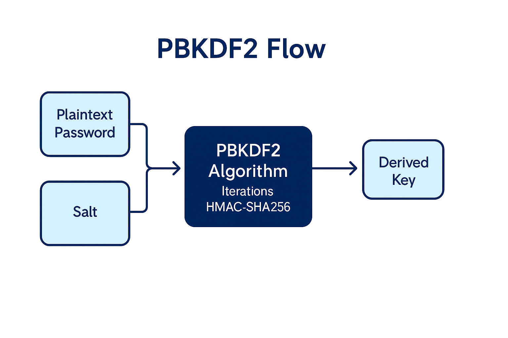

# Explanation of the Application

## The Build File

This `pom.xml` defines a Spring Boot 3.5.3 project that demonstrates using **different password hashing algorithms** (BCrypt, PBKDF2, SCrypt) within a single secure web application. Below is a structured explanation of each section:

---

## 🧱 Basic Metadata

```
<groupId>com.rollingstone</groupId>
<artifactId>spring-boot-3-spring-security-different-pw-algorithm-poc</artifactId>
<version>0.0.1-SNAPSHOT</version>
```

This sets the Maven coordinates:

* `groupId`: Java package-style identifier for your org
* `artifactId`: Project/module name
* `version`: The current build version

---

## 🧬 Parent POM

```
<parent>
	<groupId>org.springframework.boot</groupId>
	<artifactId>spring-boot-starter-parent</artifactId>
	<version>3.5.3</version>
	<relativePath/>
</parent>
```

Spring Boot provides a curated `starter-parent` POM:

* Manages dependency versions
* Sets up build plugins
* Simplifies property defaults (e.g., compiler plugin, encoding)

---

## ⚙️ Properties

```
<properties>
	<java.version>21</java.version>
</properties>
```

This project uses **Java 21**, which Spring Boot 3.2+ supports.

---

## 📦 Dependencies

### 🔐 Security

```
<dependency>
	<groupId>org.springframework.boot</groupId>
	<artifactId>spring-boot-starter-security</artifactId>
</dependency>
<dependency>
	<groupId>org.springframework.security</groupId>
	<artifactId>spring-security-crypto</artifactId>
</dependency>
```

* Adds Spring Security support.
* Includes password hashing, encryption, PBKDF2, SCrypt support (`spring-security-crypto`).

### 🔒 Bouncy Castle

```
<dependency>
	<groupId>org.bouncycastle</groupId>
	<artifactId>bcprov-jdk18on</artifactId>
	<version>1.78</version>
</dependency>
```

* Provides extra cryptographic primitives.
* Needed for SCrypt and other custom key derivation or FIPS-relevant features.

### 🗄️ Persistence

```
<dependency>
	<groupId>org.springframework.boot</groupId>
	<artifactId>spring-boot-starter-data-jpa</artifactId>
</dependency>
<dependency>
	<groupId>com.mysql</groupId>
	<artifactId>mysql-connector-j</artifactId>
	<scope>runtime</scope>
</dependency>
```

* Enables JPA (Hibernate) support.
* Connects to a MySQL database using JDBC.

### 🖥️ Web + Thymeleaf UI

```
<dependency>
	<groupId>org.springframework.boot</groupId>
	<artifactId>spring-boot-starter-web</artifactId>
</dependency>
<dependency>
	<groupId>org.springframework.boot</groupId>
	<artifactId>spring-boot-starter-thymeleaf</artifactId>
</dependency>
<dependency>
	<groupId>org.thymeleaf.extras</groupId>
	<artifactId>thymeleaf-extras-springsecurity6</artifactId>
</dependency>
```

* Web layer (Spring MVC).
* Thymeleaf for rendering HTML with Spring-friendly syntax.
* Integrates Spring Security tag support in Thymeleaf templates.

### 🧪 Testing

```
<dependency>
	<groupId>org.springframework.boot</groupId>
	<artifactId>spring-boot-starter-test</artifactId>
	<scope>test</scope>
</dependency>
<dependency>
	<groupId>org.springframework.security</groupId>
	<artifactId>spring-security-test</artifactId>
	<scope>test</scope>
</dependency>
```

* JUnit + Mockito-based test framework.
* Adds security mocking/testing tools.

---

## 🔧 Build Configuration

```xml
<build>
	<plugins>
		<plugin>
			<groupId>org.springframework.boot</groupId>
			<artifactId>spring-boot-maven-plugin</artifactId>
		</plugin>
	</plugins>
</build>
```

* Uses the `spring-boot-maven-plugin` to:

    * Package the app as a runnable JAR
    * Add `spring-boot:run` goal
    * Include application dependencies

---

## 🧠 Summary

| Feature                 | Purpose                                                             |
| ----------------------- | ------------------------------------------------------------------- |
| Spring Boot 3.5.3       | Modern, Jakarta EE-based, Spring Security 6 ready                   |
| Java 21                 | Fully up-to-date JVM features                                       |
| Multiple Password Algos | Supports BCrypt, PBKDF2, SCrypt per user (`PasswordAlgorithm` enum) |
| Thymeleaf UI            | Clean front-end rendering with Spring MVC                           |
| JPA + MySQL             | Store users and customers securely in DB                            |
| Security Testing        | Thorough testing with mock authentication and authorization         |

## Bouncing Your Own Castle 

**Bouncy Castle** is a **security library** that provides developers with tools for **encryption, decryption, digital signatures, hashing**, and other **cryptographic operations**.

### 🧩 Think of it like this:

Imagine Java’s built-in security toolbox is a basic toolkit — it has a screwdriver and wrench. But what if you need a special tool like a torque wrench or a power drill? That’s where **Bouncy Castle** comes in.

---

### 🛡️ What does Bouncy Castle provide?

* More **cryptographic algorithms** than Java’s standard libraries
* Support for **newer, experimental, or more secure algorithms** like:

    * **SCrypt** (for password hashing)
    * **ECIES** (Elliptic Curve encryption)
    * **SHA-3**, **GOST**, **Blowfish**, **Camellia**, etc.
* **Digital certificates and PKI support** (X.509, CMS, PKCS#12, etc.)
* Full **lightweight APIs** usable in Android or constrained environments

---

### ✅ Why use Bouncy Castle?

* Java’s built-in `java.security` API might **not include everything**.
* You need **FIPS-compliant** cryptography.
* You want to work with **advanced password hashing** like `SCrypt`.
* You need **stronger encryption standards** (e.g., AES-GCM, EC).

---

### 🔧 Example in your context:

Spring Security supports **BCrypt**, **PBKDF2**, and **SCrypt**. SCrypt is newer and more memory-intensive for brute-force resistance — **but it’s not available in core JDK**. So Spring uses **Bouncy Castle** behind the scenes to support it.

---

### 🤔 Why is it called *Bouncy Castle*?

It was originally a fun project started by Aussie developers who wanted a playful name — like kids jumping around in a secure, inflatable fortress.

---

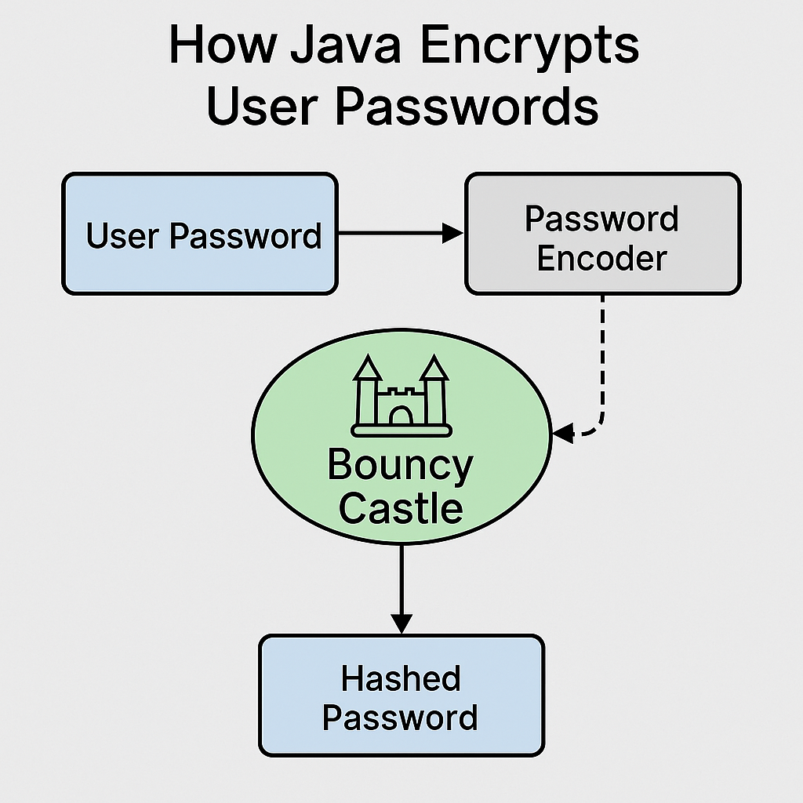

# Understanding Factories To Generate Passwords

Let’s break this into two parts:

---

### ✅ 1. `PasswordAlgorithm` Enum

```java
public enum PasswordAlgorithm {
    BCRYPT, SCRYPT, PBKDF2
}
```

**Purpose**:
This enum defines which password encoding algorithm to use. Instead of hardcoding the algorithm throughout the application, it provides a clean, type-safe way to select one from:

* `BCRYPT`: Secure and widely adopted.
* `SCRYPT`: Designed to be CPU and memory intensive to resist hardware attacks.
* `PBKDF2`: NIST-approved, FIPS-compliant key derivation function.

This makes your application flexible and future-proof by allowing dynamic selection of algorithms.

---

### ✅ 2. `PasswordEncoderFactory` Class

```java
@Component
public class PasswordEncoderFactory {
    private static final String GLOBAL_SECRET = "StrongPepperUsedAcrossAllPBKDF2Hashes";

    public PasswordEncoder getEncoder(PasswordAlgorithm algo) {
        return switch (algo) {
            case BCRYPT -> new BCryptPasswordEncoder();
            case SCRYPT -> new SCryptPasswordEncoder(16384, 8, 1, 32, 16);
            case PBKDF2 -> new Pbkdf2PasswordEncoder(
                    GLOBAL_SECRET, // pepper (optional app-wide secret)
                    16,            // salt length
                    310000,        // iterations
                    Pbkdf2PasswordEncoder.SecretKeyFactoryAlgorithm.PBKDF2WithHmacSHA256
            );
        };
    }

    public boolean matches(String rawPassword, String encodedPassword, PasswordAlgorithm algo) {
        return getEncoder(algo).matches(rawPassword, encodedPassword);
    }
}
```

**Purpose**:

* Central factory for returning the correct `PasswordEncoder` implementation based on the selected algorithm.
* Adds strong configuration (e.g., high iteration count for PBKDF2, pepper).
* Provides a helper method `matches()` to validate a raw password against a hashed password.

---

### 🔐 Password Validation Process (Step-by-Step) VIP For Engineers

#### 💾 When saving a new user (Sign-Up):

1. App receives: `username`, `plainPassword`, and `selectedAlgorithm` (e.g., PBKDF2).
2. `PasswordEncoderFactory.getEncoder(selectedAlgorithm)` is called.
3. The encoder hashes the password using a **salt** and the selected algorithm.
4. App stores the following in the database:

  * `username`
  * `hashedPassword`
  * `algorithm` (from `PasswordAlgorithm`)
  * `roles`

#### 🔓 When user logs in (Sign-In): VIP For Engineers

1. App receives `username` and `inputPassword`.
2. It loads the user from DB and gets:

  * `storedHashedPassword`
  * `storedAlgorithm`
3. It calls:

```
passwordEncoderFactory.matches(inputPassword, storedHashedPassword, storedAlgorithm);
```

4. Internally, the correct encoder is used (e.g., PBKDF2).
5. The encoder rehashes the `inputPassword` using the same algorithm and compares it to `storedHashedPassword`.
6. If match → authenticated. If not → denied.

---

### 🔍 Why This Approach Is Good

* **Algorithm Agnostic**: You can migrate to newer algorithms gradually.
* **Flexible**: Each user can have their own algorithm.
* **Secure**: Each encoder supports salt and pepper (in PBKDF2), and secure defaults.

---

## Visual Flowchart

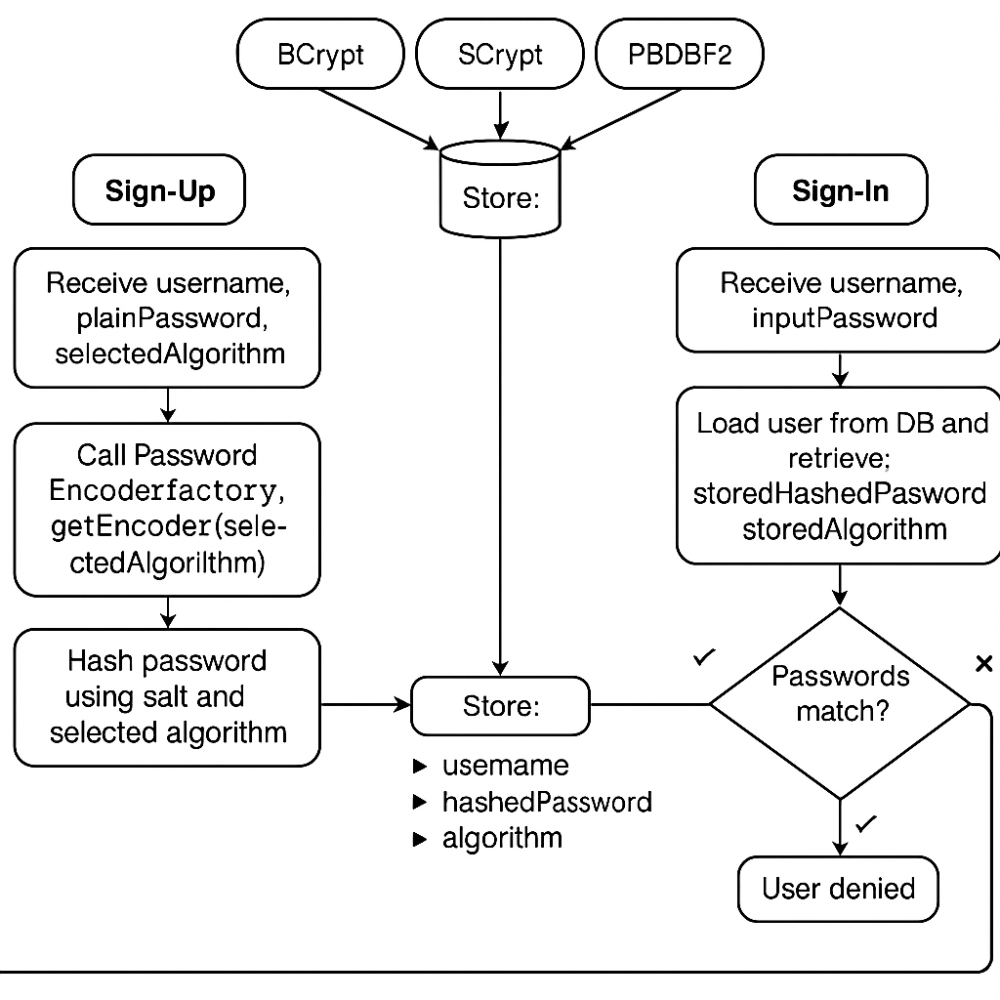

# VIP Spring Security 6 Domain Specific (Not General) Language For a REST API

This `SecurityConfig` class defines the security configuration for a Spring Boot application using Spring Security. Its main goal is to support **custom password encoding algorithms** (BCrypt, SCrypt, PBKDF2) stored per user in the database.

---

### 🔐 **What This Configuration Does**

1. **Custom Password Encoding per User** – Each user in the DB stores which algorithm was used to hash their password. This is handled using `PasswordEncoderFactory` and injected into a custom `DaoAuthenticationProvider`.

2. **Form-Based Login with Custom Login Page** – It defines a custom login page (`/login`) and redirects successfully logged-in users to `/home`.

3. **Secures Endpoints** –

  * `/api/**` is protected and accessible only by `USER` or `ADMIN` roles.
  * `/login`, static assets (`/css/**`, `/js/**`) are public.

---

### 📦 Class Members and Their Purpose

#### `@Configuration`, `@EnableWebSecurity`

Declares this as a security configuration class, enabling Spring Security features.

---

### 🔧 Beans Defined

#### 1. `SecurityFilterChain`

```
@Bean
public SecurityFilterChain securityFilterChain(HttpSecurity http)
```

This is the main DSL to define security rules.

* `authenticationProvider(customAuthProvider)` – uses your custom provider (which internally delegates to `DaoAuthenticationProvider`).
* `.authorizeHttpRequests(...)` – defines which endpoints are public and which require authentication.
* `.formLogin(...)` – enables form login and specifies a custom login page.
* `.logout(...)` – handles logout logic.
* `.csrf(AbstractHttpConfigurer::disable)` – disables CSRF (often needed in APIs).

---

#### 2. `AuthenticationManager`

```
@Bean
public AuthenticationManager authenticationManager(AuthenticationConfiguration config)
```

Provides the authentication manager based on the existing Spring Security configuration (includes the `DaoAuthenticationProvider`).

---

#### 3. `DaoAuthenticationProvider`

```
@Bean
public DaoAuthenticationProvider authProvider(UserRepository userRepo)
```

This bean configures a `DaoAuthenticationProvider` which:

* Uses your own `UserRepository` to load `AppUser` from the DB.
* Dynamically chooses the correct `PasswordEncoder` using the `PasswordAlgorithm` stored for each user.
* Builds a Spring Security `UserDetails` object dynamically.

🔍 **Important Detail:**

```
.passwordEncoder(pwd -> encoder.encode(pwd))
```

This line is **only used for matching during login**, not for re-encoding the password. Spring uses `PasswordEncoder.matches()` internally, so this is safe for our use case.

---

### 🧩 Supporting Classes in the Background

* `AppUser` – your entity with `username`, `password`, `roles`, and `algorithm`.
* `PasswordAlgorithm` – an enum (`BCRYPT`, `SCRYPT`, `PBKDF2`).
* `PasswordEncoderFactory` – a factory to return the correct encoder based on the enum.
* `CustomAuthenticationProvider` – optionally lets you plug in even more custom logic if needed.

---

### 📝 Summary

This config enables:

* A secure login flow.
* Different password hashing algorithms per user.
* A flexible, extensible authentication mechanism using Spring Security’s `DaoAuthenticationProvider`.

## Diagram showing this flow

TBD

# CustomAuthenticationProvider

The `CustomAuthenticationProvider` class is a custom implementation of Spring Security's `AuthenticationProvider` interface. Its main purpose is to enable **custom authentication logic**, especially useful in this case where **multiple password hashing algorithms (BCrypt, SCrypt, PBKDF2)** are supported per user.

---

### ✅ Breakdown of the Class

```
@Component
public class CustomAuthenticationProvider implements AuthenticationProvider {
```

* Annotated with `@Component`, so it's automatically discovered by Spring during component scanning.
* Implements `AuthenticationProvider`, which Spring Security uses to delegate authentication requests.

---

### 🔑 Dependencies

```
@Autowired
private UserRepository userRepository;

@Autowired
private PasswordEncoderFactory encoderFactory;
```

* `UserRepository`: Fetches `AppUser` objects from the database.
* `PasswordEncoderFactory`: Returns the right `PasswordEncoder` for a given hashing algorithm (`BCRYPT`, `SCRYPT`, `PBKDF2`).

---

### 🔐 Main Authentication Logic

```
@Override
public Authentication authenticate(Authentication auth) throws AuthenticationException {
```

#### 🔹 Step 1: Extract Username and Password

```
String username = auth.getName();
String rawPassword = auth.getCredentials().toString();
```

#### 🔹 Step 2: Look Up User

```
AppUser user = userRepository.findById(username)
        .orElseThrow(() -> new UsernameNotFoundException("User not found"));
```

* If the user doesn't exist, throw a `UsernameNotFoundException`.

#### 🔹 Step 3: Validate Password

```
if (!encoderFactory.matches(rawPassword, user.getPassword(), user.getAlgorithm())) {
    throw new BadCredentialsException("Invalid password");
}
```

* Uses the **right encoder** based on the user’s `algorithm` field (`BCRYPT`, `PBKDF2`, etc.).
* Calls `.matches(raw, encoded)` to validate the password.

#### 🔹 Step 4: Build Authorities

```
List<SimpleGrantedAuthority> authorities = Arrays.stream(user.getRoles().split(","))
        .map(role -> new SimpleGrantedAuthority("ROLE_" + role.trim()))
        .toList();
```

* Maps each role string (e.g., `"USER"`, `"ADMIN"`) to a `SimpleGrantedAuthority` with the `ROLE_` prefix.

#### 🔹 Step 5: Return Authentication Token

```
return new UsernamePasswordAuthenticationToken(username, user.getPassword(), authorities);
```

* Authentication is now successful.
* Spring Security stores this token in the `SecurityContext`.

---

### ✅ supports()

```
@Override
public boolean supports(Class<?> authType) {
    return UsernamePasswordAuthenticationToken.class.isAssignableFrom(authType);
}
```

* Tells Spring Security that this provider supports form-based username/password authentication.

---

### 🧠 Why Use This?

* Enables **multi-algorithm password support**.
* Allows fine-grained control of how authentication works (e.g., extra checks like account lockout).
* Works seamlessly with Spring Security’s pluggable architecture.

---

### Visual Flow

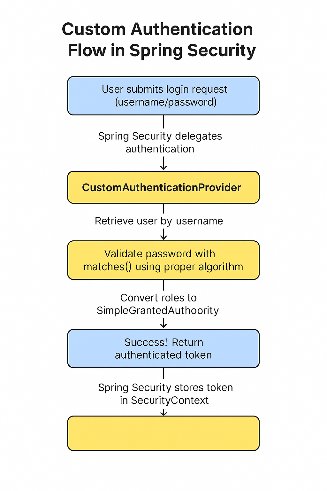

# Understanding the JPA Models

``` 
package com.rollingstone.model;

import com.rollingstone.password.PasswordAlgorithm;
import jakarta.persistence.*;

@Entity
@Table(name="APP_USER")
public class AppUser {
    @Id
    private String username;
    private String password;
    @Enumerated(EnumType.STRING)
    private PasswordAlgorithm algorithm;
    private String roles; // comma-separated (e.g., "USER,ADMIN")

    public AppUser() {
    }

    public AppUser(String username, String password, PasswordAlgorithm algorithm, String roles) {
        this.username = username;
        this.password = password;
        this.algorithm = algorithm;
        this.roles = roles;
    }

    public String getUsername() {
        return username;
    }

    public void setUsername(String username) {
        this.username = username;
    }

    public String getPassword() {
        return password;
    }

    public void setPassword(String password) {
        this.password = password;
    }

    public PasswordAlgorithm getAlgorithm() {
        return algorithm;
    }

    public void setAlgorithm(PasswordAlgorithm algorithm) {
        this.algorithm = algorithm;
    }

    public String getRoles() {
        return roles;
    }

    public void setRoles(String roles) {
        this.roles = roles;
    }

    @Override
    public String toString() {
        return "AppUser{" +
                "username='" + username + '\'' +
                ", password='" + password + '\'' +
                ", algorithm=" + algorithm +
                ", roles='" + roles + '\'' +
                '}';
    }
}


```

## Customer

``` 
package com.rollingstone.model;

public class Customer {

    Long id;
    String name;
    String email;

    public Customer(long l, String name, String email) {
        this.id = l;
        this.name = name;
        this.email = email;
    }

    public Long getId() {
        return id;
    }

    public void setId(Long id) {
        this.id = id;
    }

    public String getName() {
        return name;
    }

    public void setName(String name) {
        this.name = name;
    }

    public String getEmail() {
        return email;
    }

    public void setEmail(String email) {
        this.email = email;
    }
}

```

## The User Repository

``` 
package com.rollingstone.repository;

import com.rollingstone.model.AppUser;
import org.springframework.data.jpa.repository.JpaRepository;

public interface UserRepository extends JpaRepository<AppUser, String> {
}
```

# Controllers

## LoginController

``` 
package com.rollingstone.controller;

import org.springframework.stereotype.Controller;
import org.springframework.web.bind.annotation.GetMapping;

@Controller
public class LoginController {

    @GetMapping("/login")
    public String loginPage() {
        return "login"; // Thymeleaf template: src/main/resources/templates/login.html
    }
}

```
## HomeController

``` 
package com.rollingstone.controller;

import org.springframework.stereotype.Controller;
import org.springframework.web.bind.annotation.GetMapping;

@Controller
public class HomeController {

    @GetMapping("/home")
    public String homePage() {
        return "home"; // Thymeleaf template: src/main/resources/templates/login.html
    }
}

```
## CustomerRestController

``` 
package com.rollingstone.api;

import com.rollingstone.model.Customer;
import org.springframework.web.bind.annotation.GetMapping;
import org.springframework.web.bind.annotation.RequestMapping;
import org.springframework.web.bind.annotation.RestController;

import java.util.List;

@RestController
@RequestMapping("/api/customers")
public class CustomerRestController {

    @GetMapping
    public List<Customer> listCustomers() {
        return List.of(
                new Customer(1L, "Alice", "alice@example.com"),
                new Customer(2L, "Bob", "bob@example.com")
        );
    }
}


```

## CustomerController

``` 
package com.rollingstone.controller;


import com.rollingstone.model.Customer;
import org.springframework.stereotype.Controller;
import org.springframework.ui.Model;
import org.springframework.web.bind.annotation.GetMapping;

import java.util.List;

@Controller
public class CustomerController {

    @GetMapping("/customers")
    public String listCustomers(Model model) {
        List<Customer> customers = List.of(
                new Customer(1L, "Alice", "alice@example.com"),
                new Customer(2L, "Bob", "bob@example.com")
        );

        model.addAttribute("customers", customers);
        return "customers"; // resolves to src/main/resources/templates/customers.html
    }
}


```

## Controller to Demo Algorithm Driven Encryption

``` 
package com.rollingstone.controller;


import com.rollingstone.password.EncryptionService;
import org.springframework.stereotype.Controller;
import org.springframework.ui.Model;
import org.springframework.web.bind.annotation.*;

@Controller
@RequestMapping("/encryption")
public class EncryptionController {

    @GetMapping
    public String showForm(Model model) {
        model.addAttribute("algorithm", "bcrypt");
        return "encryption-form";
    }

    @PostMapping("/encrypt")
    public String encryptText(@RequestParam String plainText,
                              @RequestParam String algorithm,
                              Model model) {
        EncryptionService service = new EncryptionService(algorithm);
        String cipherText = service.encrypt(plainText);

        model.addAttribute("algorithm", algorithm);
        model.addAttribute("plainText", plainText);
        model.addAttribute("cipherText", cipherText);
        model.addAttribute("encrypted", true);
        return "encryption-form";
    }

    @PostMapping("/validate")
    public String validateMatch(@RequestParam String algorithm,
                                @RequestParam String plainText,
                                @RequestParam String cipherText,
                                Model model) {
        EncryptionService service = new EncryptionService(algorithm);
        boolean isValid = service.matches(plainText, cipherText);

        model.addAttribute("algorithm", algorithm);
        model.addAttribute("cipherText", cipherText);
        model.addAttribute("plainText", plainText);
        model.addAttribute("matchResult", isValid ? "✔ Match" : "❌ No Match");
        return "encryption-form";
    }
}

```

# Thymeleaf UI

## login.html

``` 
<!DOCTYPE html>
<html xmlns:th="http://www.thymeleaf.org">
<head>
    <title>Login</title>
    <link href="https://cdn.jsdelivr.net/npm/bootstrap@5.3.2/dist/css/bootstrap.min.css" rel="stylesheet">
    <style>
        body, html {
            height: 100%;
        }
        .login-wrapper {
            height: 100%;
            display: flex;
            align-items: center;
            justify-content: center;
        }
    </style>
</head>
<body class="bg-light">
<div class="container login-wrapper">
    <div class="card shadow-lg border-0" style="width: 100%; max-width: 420px;">
        <div class="card-header bg-primary text-white text-center">
            <h4 class="my-1">🔐 Secure Login</h4>
        </div>
        <div class="card-body p-4">
            <form th:action="@{/login}" method="post">
                <div class="mb-3">
                    <label for="username" class="form-label">👤 Username</label>
                    <input type="text" class="form-control" name="username" placeholder="Enter username" required />
                </div>
                <div class="mb-3">
                    <label for="password" class="form-label">🔑 Password</label>
                    <input type="password" class="form-control" name="password" placeholder="Enter password" required />
                </div>
                <button type="submit" class="btn btn-success w-100">🚀 Login</button>
            </form>
        </div>
    </div>
</div>
</body>
</html>

```

## encryption-form.html

``` 
<!DOCTYPE html>
<html xmlns:th="http://www.thymeleaf.org">
<head>
    <title>Encryption UI</title>
    <link rel="stylesheet"
          href="https://cdn.jsdelivr.net/npm/bootstrap@5.3.2/dist/css/bootstrap.min.css">
</head>
<body class="container py-5">

<div class="d-flex justify-content-between align-items-center mb-4">
    <h2>🔐 Encrypt Plain Text</h2>
    <a href="/home" class="btn btn-outline-secondary">🏠 Home</a>
</div>

<form method="post" action="/encryption/encrypt" class="mb-4">
    <div class="mb-3">
        <label for="plainText" class="form-label">Plain Text:</label>
        <input type="text" class="form-control" name="plainText" id="plainText"
               th:value="${plainText}">
    </div>

    <div class="mb-3">
        <label for="algorithm" class="form-label">Select Algorithm:</label>
        <select name="algorithm" class="form-select">
            <option value="bcrypt" th:selected="${algorithm == 'bcrypt'}">BCrypt</option>
            <option value="scrypt" th:selected="${algorithm == 'scrypt'}">SCrypt</option>
            <option value="pbkdf2" th:selected="${algorithm == 'pbkdf2'}">PBKDF2</option>
        </select>
    </div>

    <button type="submit" class="btn btn-primary">Encrypt</button>
</form>

<div th:if="${encrypted}">
    <div class="mb-3">
        <label class="form-label">Cipher Text:</label>
        <textarea class="form-control" readonly rows="3"
                  th:text="${cipherText}"></textarea>
    </div>

    <h4 class="mt-4">🔍 Validate Match</h4>
    <form method="post" action="/encryption/validate">
        <input type="hidden" name="cipherText" th:value="${cipherText}"/>
        <input type="hidden" name="algorithm" th:value="${algorithm}"/>

        <div class="mb-3">
            <label class="form-label">Enter Plain Text Again:</label>
            <input type="text" class="form-control" name="plainText"/>
        </div>

        <button type="submit" class="btn btn-warning">Validate</button>
    </form>
</div>

<div th:if="${matchResult}" class="alert alert-info mt-4">
    <strong th:text="${matchResult}"></strong>
</div>

</body>
</html>

```

## home.html

``` 
<!DOCTYPE html>
<html xmlns:th="http://www.thymeleaf.org">
<head>
    <title>Home | Welcome</title>
    <meta charset="UTF-8">
    <link href="https://cdn.jsdelivr.net/npm/bootstrap@5.3.2/dist/css/bootstrap.min.css" rel="stylesheet">
    <style>
        .card-hover:hover {
            transform: translateY(-2px);
            transition: all 0.2s ease-in-out;
            box-shadow: 0 0 15px rgba(0, 123, 255, 0.2);
        }
    </style>
</head>
<body class="bg-light">
<div class="container py-5">
    <div class="text-center mb-5">
        <h2 class="text-primary fw-bold">👋 Welcome, <span th:text="${#authentication.name}">User</span>!</h2>
        <p class="text-muted">Glad to see you back. Choose what you’d like to do:</p>
    </div>

    <div class="row justify-content-center g-4">
        <div class="col-md-4">
            <a href="/customers" class="text-decoration-none">
                <div class="card card-hover border-0 shadow-sm h-100">
                    <div class="card-body text-center">
                        <div class="display-4 text-info">📋</div>
                        <h5 class="card-title mt-3">View Customers</h5>
                        <p class="card-text text-muted">Access your full customer directory</p>
                    </div>
                </div>
            </a>
        </div>

        <div class="col-md-4">
            <a href="/encryption" class="text-decoration-none">
                <div class="card card-hover border-0 shadow-sm h-100">
                    <div class="card-body text-center">
                        <div class="display-4 text-success">🔐</div>
                        <h5 class="card-title mt-3">Encryption Tool</h5>
                        <p class="card-text text-muted">Encrypt and validate your secure texts</p>
                    </div>
                </div>
            </a>
        </div>

        <div class="col-md-4">
            <a href="/logout" class="text-decoration-none">
                <div class="card card-hover border-0 shadow-sm h-100">
                    <div class="card-body text-center">
                        <div class="display-4 text-danger">🚪</div>
                        <h5 class="card-title mt-3">Logout</h5>
                        <p class="card-text text-muted">Securely exit your session</p>
                    </div>
                </div>
            </a>
        </div>
    </div>
</div>
</body>
</html>

```

## customers.html

``` 
<!DOCTYPE html>
<html xmlns:th="http://www.thymeleaf.org">
<head>
    <title>Customers</title>
    <link href="https://cdn.jsdelivr.net/npm/bootstrap@5.3.2/dist/css/bootstrap.min.css" rel="stylesheet">
    <script src="https://cdn.jsdelivr.net/npm/bootstrap@5.3.2/dist/js/bootstrap.bundle.min.js"></script>
</head>
<body class="bg-light">
<div class="container py-5">
    <div class="d-flex justify-content-between align-items-center mb-4">
        <h3 class="text-primary">📋 Customer List</h3>
        <a href="/home" class="btn btn-outline-secondary">🏠 Back to Home</a>
    </div>
    <div class="card shadow-sm border-0">
        <div class="card-body p-4">
            <table class="table table-hover align-middle" id="customer-table">
                <thead class="table-light">
                <tr>
                    <th scope="col">🆔 ID</th>
                    <th scope="col">👤 Name</th>
                    <th scope="col">📧 Email</th>
                </tr>
                </thead>
                <tbody class="table-group-divider"></tbody>
            </table>
        </div>
    </div>
</div>

<script>
    fetch("/api/customers")
        .then(res => res.json())
        .then(data => {
            const tbody = document.querySelector("#customer-table tbody");
            data.forEach(c => {
                tbody.innerHTML += `
                    <tr>
                        <td>${c.id}</td>
                        <td>${c.name}</td>
                        <td>${c.email}</td>
                    </tr>`;
            });
        });
</script>
</body>
</html>

```

# Quarterly Bonus : Spring Security Flow

Here's a breakdown of how **Spring Security** works **during user creation (password hashing)** and **during login (authentication)** — including the **core classes** involved in each phase.

---

## 🔐 1. **User Creation & Password Hashing Flow (e.g., during Registration)**

When a user is registered and a password is saved securely, Spring Security provides classes to **hash** the password.

### ✅ Key Classes in User Creation

| Step | Responsibility                                        | Spring Security Class                                                                                                                |
| ---- | ----------------------------------------------------- | ------------------------------------------------------------------------------------------------------------------------------------ |
| 1    | Accept raw password input (e.g., `"password"`)        | Your controller or service                                                                                                           |
| 2    | Choose or inject the algorithm (BCrypt, PBKDF2, etc.) | `PasswordEncoderFactory` (custom)                                                                                                    |
| 3    | Encode the raw password securely                      | `PasswordEncoder` implementations like:<br> 🔸 `BCryptPasswordEncoder`<br> 🔸 `Pbkdf2PasswordEncoder`<br> 🔸 `SCryptPasswordEncoder` |
| 4    | Save the encoded password and algorithm               | Your custom `AppUser` entity + `UserRepository`                                                                                      |

### ✳️ Example:

```
PasswordEncoder encoder = passwordEncoderFactory.getEncoder(PasswordAlgorithm.BCRYPT);
String encodedPassword = encoder.encode("password123");
userRepository.save(new AppUser("alice", encodedPassword, PasswordAlgorithm.BCRYPT, "USER"));
```

### ⚠️ Important:

Spring Security **does not automatically hash passwords** when saving — you must do this explicitly using a `PasswordEncoder`.

---

## 🔁 2. **Login & Password Verification Flow**

This is the real-time **authentication flow** when a user logs in through form-based login.

### 🔄 Sequence of Components Involved

```text
User submits login form → AuthenticationFilter → AuthenticationManager →
AuthenticationProvider (e.g., DaoAuthenticationProvider) →
UserDetailsService → PasswordEncoder → Authentication result
```

### ✅ Key Classes in Login Flow

| Step | Purpose                                      | Spring Security Component                                                                                           |
| ---- | -------------------------------------------- | ------------------------------------------------------------------------------------------------------------------- |
| 1    | Intercepts login POST request                | `UsernamePasswordAuthenticationFilter` (part of filter chain)                                                       |
| 2    | Builds `UsernamePasswordAuthenticationToken` | Provided by Spring Security                                                                                         |
| 3    | Delegates to authentication providers        | `AuthenticationManager`                                                                                             |
| 4    | Authenticates with user data                 | `AuthenticationProvider` like:<br> 🔸 `DaoAuthenticationProvider`<br> 🔸 or your own `CustomAuthenticationProvider` |
| 5    | Loads user info                              | `UserDetailsService` or custom lambda                                                                               |
| 6    | Verifies password                            | `PasswordEncoder.matches(raw, hashed)`                                                                              |
| 7    | On success, creates `Authentication` object  | `UsernamePasswordAuthenticationToken` with roles                                                                    |

---

## 🧠 Summary Table

| Phase                      | What Happens                       | Key Classes                                                                                |
| -------------------------- | ---------------------------------- | ------------------------------------------------------------------------------------------ |
| **User Creation**          | Raw password is encoded and stored | `PasswordEncoder`, your custom service                                                     |
| **Login Start**            | Form request intercepted           | `UsernamePasswordAuthenticationFilter`                                                     |
| **Authentication Process** | User info + password matched       | `AuthenticationManager`, `AuthenticationProvider`, `PasswordEncoder`, `UserDetailsService` |
| **On Success**             | Session + authorities assigned     | `SecurityContext`, `UsernamePasswordAuthenticationToken`                                   |

---

## 🧩 Optional Enhancements

* Add `CustomAuthenticationProvider` to handle algorithm lookup dynamically from DB.
* Add prefix-based encoder (`{bcrypt}`, `{pbkdf2}`) to use `DelegatingPasswordEncoder`.
* Customize login success with `AuthenticationSuccessHandler`.

## Visual Flow

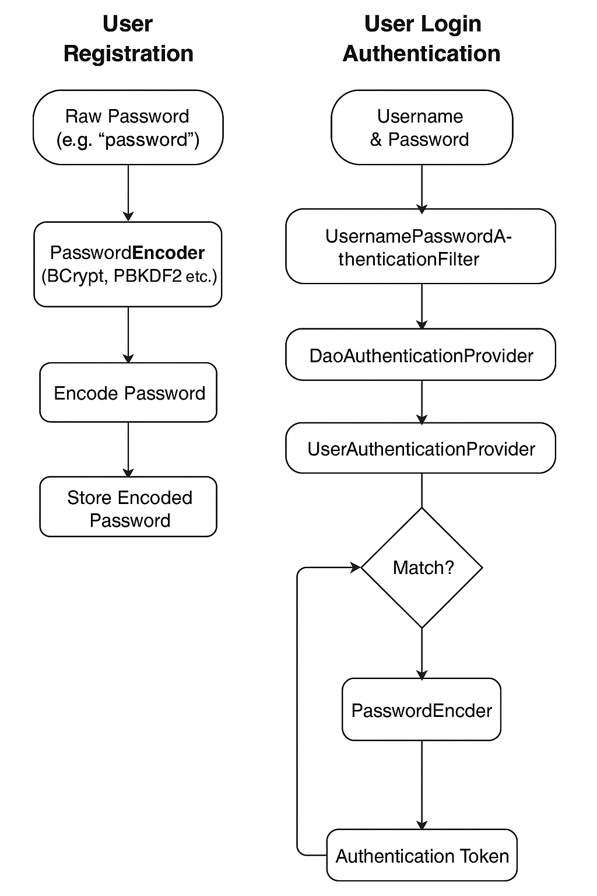


